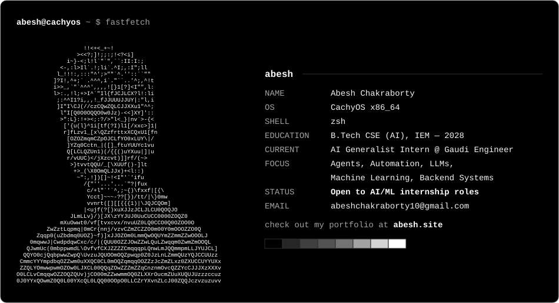

<!-- fastfetch-*.svg come from fastfetch.py: edit it, run it, commit -->
<picture>
  <source media="(prefers-color-scheme: dark)" srcset="fastfetch-dark.svg">
  <source media="(prefers-color-scheme: light)" srcset="fastfetch-light.svg">
  
</picture>
